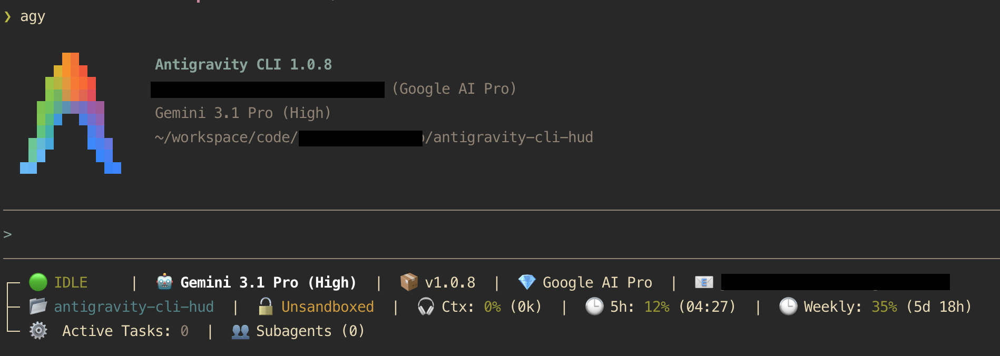

# Antigravity HUD Plugin



A production-grade, highly responsive terminal HUD for the Antigravity CLI. It dynamically monitors your agent state, token context, quota buckets, and active subagents in real-time.

```text
▌ 🔵 [TARS] WORKING  |  🔵 plan  |  🤖 Gemini 3.6 Flash  |  Effort: 󰾆 high  |  🧠 Skills: looper & tdd & mapper
│ 📂 acme-corp/work  |  🔓 Unsandboxed  |  ⚡ Cache: 120k  |  🎧 Ctx: ▰▰▰▰▱ 72% (54k/75k)
│ 👟 Steps: ▰▰▰▰▱ 14/20  |  🕒 5h: ▰▰▱▱▱ 45% (01:00)  |  🕒 Weekly: ▰▰▰▰▱ 85% (2d 0h)
│ ⚙️  Active Tasks: 3  |  👥 Subagents:  |  🛠️  run_command (git status)
│                             orchestrator [id:abc123] [working] (Epic Runner)
│                               ↳ worker-1 [id:def678] [working] (Feature Dev)
│                                 ↳ researcher [id:ghi112] [completed] (Context Finder)
│                             ...and 1 more hidden
│ 📄 Artifacts (open ~/.gemini/antigravity-cli/brain/ad266f1f*):
│     architecture_review.md
│     database_schema.md
│ 🔄 Active Looper Missions:
│     🎯 acme-corp/work - Epic: auth-v2 ▰▰▰▱▱ [3/5 DONE]
│     • sample_faqs - setup/M1_setup [IN_PROGRESS Iteration 2/5]
│     • auth-system - auth/epic_runner [DONE]
│ 🌱 Active Branches:
│     acme-corp/work (feature/hud-nested-agents)
│     acme-corp/service-b (main)
│ 📜 tail -f ~/.gemini/antigravity-cli/brain/ad266f1f-75f3-44dd-b073-c93a1bedc277/.system_generated/logs/transcript.jsonl
```

To run this demo in your terminal:
```bash
node scripts/demo.js
```

## Architecture & Features

This plugin was engineered with strict defensive paradigms and advanced layout algorithms to guarantee zero-crash execution and a flawless visual experience:

- **Dynamic Matrix Engine**: Features a fully configurable JSON-driven grid system. You can freely re-arrange metrics (like Model, Workspace, Context, and Quotas) into any row or order based on terminal width. See [LAYOUT_ENGINE.md](LAYOUT_ENGINE.md) for full configuration specs.
- **Hysteresis Filtering & Strict Padding**: Mathematically absorbs micro-fluctuations in UI layout padding. By combining a 5-column hysteresis cache with strict 7-character string padding, it completely eliminates both horizontal and vertical UI bouncing during rapid state transitions.
- **Interactive Config Wizard**: Ships with a built-in AI skill (`/hud-config`) that allows you to chat with an agent to visually re-arrange your HUD matrix on the fly!
- **Ironclad Execution**: Wrapped in global `try/catch` handlers with hardcoded fallback strings. Even if the incoming telemetry JSON payload is violently malformed, the plugin will NEVER crash the Antigravity session.
- **High-Performance Build**: Hand-written in TypeScript and bundled via `esbuild` into a single, dependency-free ECMAScript Module (`dist/index.js`) that executes in **~1ms**.

## Installation

To install the plugin, clone the repository, build it, and install it locally via the Antigravity CLI:

```bash
git clone https://github.com/jdiazromeral/antigravity-cli-hud.git
cd antigravity-cli-hud
npm install
npm run build
agy plugin install .
```

## Configuration

To customize exactly what information appears on your HUD (and in what order), simply invoke the built-in configuration skill directly inside an active Antigravity chat session:

> `/hud:hud-config`

The AI will interactively guide you through customizing your layouts for Small, Medium, and Large terminal widths, and automatically recompile the binary for you!

## Usage

To activate the HUD inside an active Antigravity chat session, run the following slash command:

```bash
/statusline ~/.gemini/config/plugins/hud/hooks/status-line.sh
```

To activate the dynamic Terminal Title hook:

```bash
/title ~/.gemini/config/plugins/hud/hooks/title.sh
```

To revert back to the default minimal status line:

```bash
/statusline delete
```

## Development & Testing

This project maintains a robust, highly mocked unit test suite powered by `vitest` to ensure the responsive mathematical layout and payload parser never regress.

To run the test suite:
```bash
npm run test
```

To generate a fully-populated mock HUD UI in your terminal (useful for taking screenshots):
```bash
npm run demo
```

## 🚀 What's New

For full release history and version details, see the **[CHANGELOG.md](CHANGELOG.md)**.

### Latest Updates (v1.1.9)
- **Session Step Budget Block (`steps`):** Real-time tracking of session step ceilings (`👟 Steps: ▰▰▰▰▱ 14/20`).
- **Bundled Token Evaluation Hook:** Included `scripts/token_eval_hook.py` executable script for token ledger logging and budget enforcement.
- **Multi-Skill Telemetry Block (`skill`):** Real-time tracking of single (`🧠 Skill: looper`) or multiple (`🧠 Skills: looper & tdd & mapper`) active skills.
- **Micro Progress Bars:** Dynamic 5-character progress bars (`▰▰▱▱▱`) for `Ctx`, `5h`, `Weekly` quotas, and Looper Epics.
- **Modern Accent Bar UI:** Replaced comb brackets with a state-colored vertical bar (`▌`) and clean guide line (`│`).
- **Active Tool Execution Block (`tool`):** Renders active tool execution status in real-time (`🛠️ run_command (git status)`).
- **Subagent Conversation Tracking:** Displays truncated subagent conversation IDs (`[id:sub-88]`).
- **Strict Session Scoping:** Prevents auto-scanning unrelated branches when outside active session context (`hud_context.json`).
- **Contextual Terminal Window Titles:** Explicit `repo:branch` tab title formatting.

## Understanding Telemetry Blocks

The HUD dynamically parses the CLI's internal JSON telemetry stream. It receives continuous heartbeat pulses and instant triggers on any state change, meaning every metric updates with zero latency. 

Here are all the available blocks you can slot into your matrix:

- **`state`**: The core Antigravity Agent state (🟢 IDLE, 🟡 WAITING, 🔵 WORKING).
- **`mode`**: The active execution mode of the CLI (🟡 request-review, 🟢 accept-edits, 🔵 plan).
- **`effort`**: The effort tier of the model (e.g. 󰾆 High, Low) introduced in v1.1.5.
- **`model`**: The underlying AI model currently driving the agent (e.g. Gemini 3.1 Pro). If a custom `agent` name is streamed, it natively overrides the state label.
- **`sandbox`**: The file-system security boundary (🔒 Sandboxed or 🔓 Unsandboxed).
- **`permissions`**: The Danger Mode indicator. Visually flags if the agent was granted recursive `AGY_SKIP_PERMISSIONS=1` access across the process tree.
- **`workspace`**: The true repository name. Natively tracks AI session context via `hud_context.json` to ensure explicitly targeted directories are visible without polluting the view with unrelated subfolders!
- **`looper`**: The Active Looper Missions block. Dynamically scans `.looper/epics/` in your active repositories to track autonomous task progress. Stacks line-by-line (`🔄 Active Looper Missions:`) and renders statuses with custom colors (e.g., `sample_faqs - auth-system/M1 [IN_PROGRESS]`). Automatically hides itself if no missions are active.
- **`git`**: The Active Branches block. Dynamically stacks line-by-line (`🌱 Active Branches:`) to cleanly display multi-repo worktrees alongside their active branches.
- **`artifacts`**: The Active Artifacts block. Dynamically stacks line-by-line (`📄 Artifacts:`) to list the `.md` files generated during the active AI session. Automatically hides itself if no artifacts exist.
- **`transcript`**: A clickable shortcut link directly to your agent's active `transcript.jsonl` log file, making it easy to `tail -f` the brain logs.
- **`tool`**: Active Tool Execution block (e.g. `🛠️ run_command (git status)`). Displays real-time tool calls streamed in telemetry; automatically culled when no tool is running.
- **`ctx`**: Context window saturation limit. Shows percentage used and raw token count.
- **`cache`**: Context window caching telemetry (`⚡ Cache: 70k`). Displays how many tokens were read from cache, allowing you to instantly visualize your cost savings. Automatically hides if 0.
- **`5h` / `weekly`**: Rolling quota buckets. Shows percentage used and the countdown timer until the quota bucket resets.
- **`tasks`**: Active asynchronous background processes (shell commands, cron jobs, active timers, or background scripts) spawned by the CLI.
- **`subagents`**: Active parallel AI subagents. Surfacing subagent IDs (`[id:abc123]`). Grandchild subagents (depth > 0) are visually nested in a tree hierarchy using `↳` characters. The list dynamically truncates to 3 lines with a hidden counter to preserve vertical layout stability.
- **`version`**: The installed version of the Antigravity CLI.
- **`email`**: The authenticated user's email address.
- **`plan`**: The active billing tier of the user account.

### Traffic Light Color Coding

To help you monitor your resource consumption at a glance, all percentage-based telemetry blocks (`Ctx`, `5h`, `Weekly`) employ a dynamic 3-tier "Traffic Light" thresholding system:
- 🟢 **Safe (< 60%)**: Renders in Green, indicating you have plenty of room.
- 🟡 **Warning (60% - 84%)**: Renders in Yellow, indicating you are eating into your limits and should be mindful.
- 🔴 **Critical (>= 85%)**: Renders in Red, indicating you are in the danger zone and about to hit your maximum limit.
*(Note: If your Context ever exceeds 200k tokens, the HUD will immediately override to Red and display an explicit 🚨 >200k! warning).*

### Dynamic Culling

By default, the HUD Engine utilizes "Dynamic Culling". This means that if your `Active Tasks` or `Subagents` counts are zero, those blocks are completely removed from the visual layout to prevent terminal clutter. If they are the only elements on their respective row, the entire empty row is safely collapsed. 

You can disable this behavior to always show the blocks (e.g. `Active Tasks: 0`) by changing the flag in your config:
```typescript
export const HUD_CONFIG = {
  autoHideEmptyBlocks: false, // Set to false to always render empty blocks
  // ...
};
```

## ⚙️ Configuration & Environment Variables

The HUD supports a 3-tier hybrid priority resolution engine for context window and step budget ceilings:

```
Priority 1: Environment Variables (AGY_MAX_CONTEXT_TOKENS / AGY_MAX_STEPS)
    ↓ (If undefined)
Priority 2: HUD Config & Skill Wizard (HUD_CONFIG.budget / /hud-config)
    ↓ (If undefined)
Priority 3: Physical Telemetry (context_window_size / 1M)
```

### Environment Variables

| Variable | Description | Default | Example |
| :--- | :--- | :--- | :--- |
| `AGY_MAX_CONTEXT_TOKENS` | Custom context window ceiling for soft budget tracking. | `75000` | `export AGY_MAX_CONTEXT_TOKENS=1000000` |
| `AGY_MAX_STEPS` | Custom session step ceiling for turn budget tracking. | `20` | `export AGY_MAX_STEPS=30` |
| `AGY_SKIP_PERMISSIONS` | Toggles Danger Mode indicator in HUD statusline (`☢️ Danger Mode`). | `false` | `export AGY_SKIP_PERMISSIONS=true` |

### Bundled Token Ledger & Evaluation Hook

Included in `scripts/token_eval_hook.py` is a security-hardened token evaluation hook:
* **Zero Content Disclosure:** Evaluates prompt turn steps and character lengths without storing raw text or code.
* **Strict Permissions (`0600`):** Enforces user-only read/write permissions on ledger log files.
* **Path Containment:** Verifies `transcriptPath` is rooted inside `~/.gemini/antigravity-cli/brain/`.
* **Token Ledger:** Appends session token metrics to `~/.gemini/antigravity-cli/token_ledger.jsonl`.

## Documentation

- **[LAYOUT_ENGINE.md](LAYOUT_ENGINE.md)**: Technical spec for the HUD Matrix JSON engine.
- **[HOOKS.md](HOOKS.md)**: Official documentation reverse-engineering the Antigravity CLI's telemetry JSON stream and `stdin` event loop.
